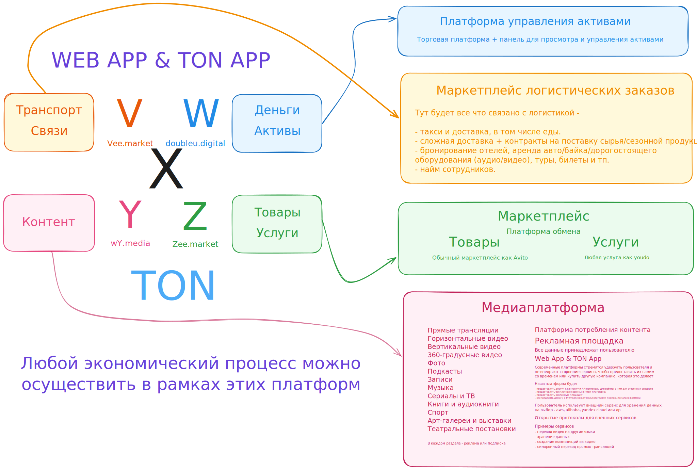

# X Digital Marketplace - NFT Экосистема



🌍 **Language / Язык / 语言**: [English](README.md) | [Русский](ru/README.md) | [中文](cn/README.md)

X Digital Marketplace трансформирован в единую NFT-ориентированную экосистему, где все экономические отношения представлены в виде смарт-контрактов и NFT. Проект объединяет медиа, финансы, бизнес и логистику через визуальный конструктор NFT-контрактов с поддержкой различных блокчейнов.

## 🆕 Новая концепция: Визуальный конструктор NFT

Мы создали мощный визуальный редактор NFT-контрактов, который позволяет:

- **Создавать NFT-контракты без программирования** через drag-and-drop интерфейс
- **Генерировать код для TON для MVP** (с планом расширения на Ethereum, Polygon, BNB Chain)
- **Использовать готовые компоненты** для медиа, бизнеса, финансов и логистики
- **Визуально проектировать экономические отношения** между участниками экосистемы

## 🚀 Быстрый старт

### 1. Базовый конструктор
Откройте [nft-marketplace.html](nft-marketplace.html) для создания простых NFT-контрактов с шаблонами.

## 📋 Типы NFT контрактов

### 🎬 Медиа NFT
- **Контент и авторские права**
- **Система роялти и лицензирования**
- **Хранилище и доставка медиа-контента**
- **Монетизация через токены YDM**

### 💼 Бизнес NFT  
- **Эскроу контракты для сделок**
- **Поэтапная оплата с milestone**
- **Система репутации и отзывов**
- **Автоматическое разрешение споров**

### 💰 Финансовые NFT
- **Вестинг токенов с тайм-локами**
- **Yield farming и стейкинг**
- **Пулы ликвидности и обмен**
- **Инвестиционные контракты**

### 🚚 Логистические NFT
- **Отслеживание доставки в реальном времени**
- **Страхование и подтверждение доставки**
- **Оптимизация маршрутов через AI**
- **Мультимодальные транспортные цепочки**

## 🛠️ Возможности конструктора

### Визуальный интерфейс
- **Drag-and-drop** компонентов на рабочую область
- **Категоризированные компоненты** по типам (медиа, бизнес, финансы, логистика)
- **Предпросмотр кода** в реальном времени
- **Редактирование свойств** каждого компонента

#### Схема работы конструктора NFT

```
┌───────────────┐      ┌───────────────┐      ┌───────────────┐      ┌───────────────┐      ┌───────────────┐
│  Библиотека   │      │ Drag-and-drop │      │   Настройка   │      │ Предпросмотр  │      │ Развертывание │
│  компонентов  │ ──▶  │   на холст    │ ──▶  │   свойств     │ ──▶  │  и генерация  │ ──▶  │  в TON (MVP)  │
│               │      │               │      │               │      │     кода      │      │               │
└───────────────┘      └───────────────┘      └───────────────┘      └───────────────┘      └───────────────┘
```

1. **Библиотека компонентов**: Выбор из готовых шаблонов для различных типов NFT
2. **Drag-and-drop на холст**: Визуальное размещение и соединение компонентов
3. **Настройка свойств**: Определение параметров каждого компонента
4. **Предпросмотр и генерация кода**: Автоматическое создание смарт-контракта
5. **Развертывание в TON**: Публикация контракта в блокчейне TON для MVP

### Поддержка блокчейнов
- **TON Network** - приоритетный блокчейн для MVP с низкими комиссиями
- **Ethereum** - самая популярная платформа смарт-контрактов (план расширения)
- **Polygon** - масштабируемое решение для Ethereum (план расширения)
- **BNB Chain** - быстрый и дешевый блокчейн от Binance (план расширения)

### Генерация кода
- **Автоматическая генерация** готового к развертыванию кода
- **Оптимизация под выбранный блокчейн**
- **Встроенные проверки безопасности**
- **Документация и комментарии**

## 🎯 Как использовать

### Шаг 1: Выберите тип NFT
Определитесь, какой тип экономических отношений вы хотите токенизировать:
- Медиа контент и авторские права
- Бизнес-контракты и сделки  
- Финансовые инструменты
- Логистические процессы

### Шаг 2: Соберите контракт
Используйте визуальный конструктор:
- Перетащите нужные компоненты
- Настройте параметры каждого компонента
- Просмотрите сгенерированный код

### Шаг 3: Разверните контракт
- Сохраните шаблон для повторного использования
- Скопируйте сгенерированный код
- Разверните контракт в выбранной сети

## 📊 Экономическая модель

### Распределение токенов
- **51%** - Основной фонд развития экосистемы
- **15%** - Разработчики и техническая команда
- **15%** - Партнеры и исполнители платформ  
- **10%** - Пользователи и держатели токенов
- **9%** - Резерв для инвестиций и бонусов

### Типы токенов
- **XDM** - Основной токен экосистемы
- **YDM** - Токены медиа-платформы
- **WDM** - Финансовые токены
- **ZDM** - Торговые токены
- **VDM** - Логистические токены

## 🛠️ Техническая архитектура

### Смарт-контракты
- **Модульная архитектура** для легкой комбинации компонентов
- **Стандарты NFT** (ERC-721, ERC-1155, TON NFT стандарт)
- **Кросс-чейн совместимость** для максимальной гибкости (начиная с TON для MVP)
- **Автоматическое тестирование** сгенерированного кода

### Безопасность
- **Проверенные шаблоны** без известных уязвимостей
- **Встроенные механизмы защиты** от атак
- **Аудит кода** перед генерацией
- **Резервное копирование** и восстановление

## 📚 Документация

Подробная информация о компонентах и возможностях:

### Оригинальная документация
- [Y Media](ru/Y.md) - Медиа компоненты и контент
- [W Digital](ru/W.md) - Финансовые инструменты  
- [Z Market](ru/Z.md) - Торговые механизмы
- [V Market](ru/V.md) - Логистические процессы
- [X Digital](ru/X.md) - Общая архитектура

### Примеры использования
- Создание NFT для цифрового контента
- Токенизация бизнес-процессов
- Финансовые инструменты на блокчейне
- Логистические цепочки в NFT

## 🤝 Участие в проекте

### Для разработчиков
- Создавайте новые компоненты для конструктора
- Улучшайте генерацию кода
- Добавляйте поддержку новых блокчейнов

### Для бизнеса
- Используйте готовые NFT-решения
- Заказывайте индивидуальные контракты
- Интегрируйте существующие системы

### Для сообщества
- Тестируйте новые функции
- Предлагайте улучшения
- Создавайте обучающие материалы

## 📞 Контакты и поддержка

- **Техническая поддержка**: [support@x.digital](mailto:support@x.digital)
- **Бизнес-запросы**: [business@x.digital](mailto:business@x.digital)  
- **Разработка**: [dev@x.digital](mailto:dev@x.digital)
- **Сообщество**: [community@x.digital](mailto:community@x.digital)

---

**X Digital Marketplace - визуальное будущее NFT-экономики** 🚀